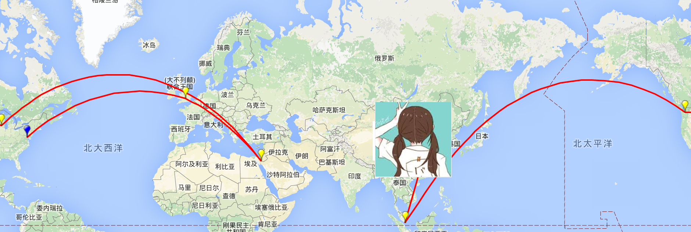

# Route2Map


## Usage

```
$ traceroute -P icmp yahoo.com | ./route2map.py
traceroute: Warning: yahoo.com has multiple addresses; using 65.55.143.19
traceroute to yahoo.com (65.55.143.19), 64 hops max, 72 byte packets
 1  192.168.0.1    Local
 2  192.168.1.1    Local
 ... #Hide for my privacy
 7  202.97.33.74   202.97.0.0,202.97.127.255,CN,Beijing,Beijing CN,Beijing,Beijing 39.9059631,116.391248
 8  202.97.91.14   202.97.0.0,202.97.127.255,CN,Beijing,Beijing CN,Beijing,Beijing 39.9059631,116.391248
 9  202.97.61.58   202.97.0.0,202.97.127.255,CN,Beijing,Beijing CN,Beijing,Beijing 39.9059631,116.391248
10  202.97.121.126 202.97.0.0,202.97.127.255,CN,Beijing,Beijing CN,Beijing,Beijing 39.9059631,116.391248
11  104.44.226.62  104.44.226.0,104.44.226.255,SG,,Singapore SG,,Singapore 1.2904527,103.852038
12  207.46.38.146  207.46.0.0,207.46.255.255,US,Washington,Seattle US,Washington,Seattle 47.6038321,-122.3300624
13  104.44.9.183   104.44.9.0,104.44.9.255,US,Wisconsin,Madison US,Wisconsin,Madison 43.074761,-89.3837612
14  104.44.8.195   104.44.0.0,104.44.8.255,IL,South District,Eilat IL,South District,Eilat 29.5569348,34.9497949
15  25.149.65.189  25.0.0.0,25.255.255.255,GB,Oxfordshire,Kidlington GB,Oxfordshire,Kidlington 51.823462,-1.2885317
16  * * *
17  * * *
18  * * *
19  65.55.143.19   65.55.128.0,65.55.159.255,US,District of Columbia,Washington US,District of Columbia,Washington 38.8949549,-77.0366456
```


## PREREQUISITES

Get Free db-ip data base

```
https://db-ip.com/db/
Choose IP to City DB (The best one can be used as free user)
```

You'll get a csv file name like following

```
dbip-city-2016-01.csv
```

Rename the file to following

```
mv dbip-city-2016-01.csv db.csv
```

Generate a index

```
cat db.csv | perl -ne 'BEGIN{$Off=0};if(/"(\d+\.\d+\.\d+\.\d+)"/) {print pack("C4",split /\./,$1);print pack("V",$OFF);print pack("V",length($_));$OFF+=length($_)}else{last}'>index

```

Install pyyaml


```
pip install --user pyyaml
```

## LIMITATION

Only IPv4 address supported

We don't have all the city's coordinates, if you see a "~" sign, that means the coordinates is chooes from one of another city in the same province/state, if you see "~~" sign that means it choose another city in the country.

## 3PP PYTHON MODULE
Pygmaps

License: GNU GPL v3

```
https://code.google.com/p/pygmaps/
```

## LICENSE

BSD

    Copyright (c) 2016, Boying Xu All rights reserved.

    Redistribution and use in source and binary forms, with or without modification, are permitted provided that the following conditions are met:

        Redistributions of source code must retain the above copyright notice, this list of conditions and the following disclaimer.

        Redistributions in binary form must reproduce the above copyright notice, this list of conditions and the following disclaimer in the documentation and/or other materials provided with the distribution.

        Neither the name of the copyright holder nor the names of its contributors may be used to endorse or promote products derived from this software without specific prior written permission.

        THIS SOFTWARE IS PROVIDED BY THE COPYRIGHT HOLDERS AND CONTRIBUTORS "AS IS" AND ANY EXPRESS OR IMPLIED WARRANTIES, INCLUDING, BUT NOT LIMITED TO, THE IMPLIED WARRANTIES OF MERCHANTABILITY AND FITNESS FOR A PARTICULAR PURPOSE ARE DISCLAIMED. IN NO EVENT SHALL THE COPYRIGHT HOLDER OR CONTRIBUTORS BE LIABLE FOR ANY DIRECT, INDIRECT, INCIDENTAL, SPECIAL, EXEMPLARY, OR CONSEQUENTIAL DAMAGES (INCLUDING, BUT NOT LIMITED TO, PROCUREMENT OF SUBSTITUTE GOODS OR SERVICES; LOSS OF USE, DATA, OR PROFITS; OR BUSINESS INTERRUPTION) HOWEVER CAUSED AND ON ANY THEORY OF LIABILITY, WHETHER IN CONTRACT, STRICT LIABILITY, OR TORT (INCLUDING NEGLIGENCE OR OTHERWISE) ARISING IN ANY WAY OUT OF THE USE OF THIS SOFTWARE, EVEN IF ADVISED OF THE POSSIBILITY OF SUCH DAMAGE.

